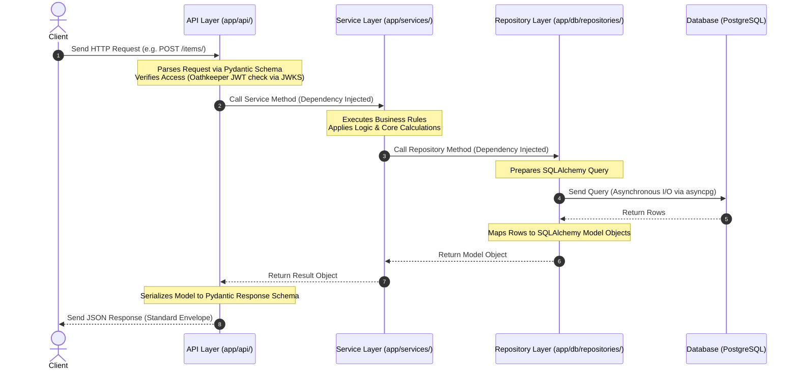

# Project Structure Guide

This document outlines the codebase layout, module responsibilities, and directory relationships in this **FastAPI
Microservice Template**.

The template is organized according to **Clean Architecture** patterns, separating external transport, business rules,
and database concerns.

---

## Workspace Directory Tree

Below is the directory tree of the repository:

```text
fastapi-template/
├── .github/                      # GitHub Actions workflows & issue/PR templates
│   ├── ISSUE_TEMPLATE/           # Structured bug & feature request forms
│   │   ├── bug_report.yml
│   │   ├── feature_request.yml
│   │   └── config.yml
│   ├── workflows/                # CI/CD pipeline definitions
│   │   ├── ci.yml                # Linting, formatting, security, testing gates
│   │   └── release.yml           # Semantic tagging & release notes generator
│   ├── pull_request_template.md  # Standard checklist for Pull Requests
├── alembic/                      # Alembic schema migration environment
│   ├── versions/                 # Auto-generated database migration scripts
│   ├── env.py                    # Migration engine & configuration
│   └── script.py.mako            # Template for new migration files
├── app/                          # Core FastAPI Application Package
│   ├── api/                      # Transport Layer (HTTP request/response handling)
│   │   ├── v1/                   # Version 1 API Grouping
│   │   │   ├── endpoints/        # Route controllers / handlers
│   │   │   │   └── health.py     # Liveness & readiness probes
│   │   │   ├── dependencies.py   # Global and endpoint dependency injections
│   │   │   └── router.py         # Main V1 routing assembly
│   │   └── router.py             # Root routing assembly
│   ├── core/                     # Application bootstrapping & configuration
│   │   ├── config.py             # Settings loader via Pydantic BaseSettings
│   │   ├── security.py           # Oathkeeper JWKS integration & JWT validation
│   │   ├── events.py             # Lifecycle event listeners (startup/shutdown)
│   │   └── settings.py           # Base configuration parameters
│   ├── db/                       # Persistence configuration & repositories
│   │   ├── repositories/         # Database access abstraction layer
│   │   │   └── base.py           # BaseRepository carrying generic CRUD operations
│   │   ├── base.py               # Combined model register for Alembic autogeneration
│   │   ├── base_class.py         # Declarative Base class and TimestampMixin for audit fields
│   │   └── session.py            # Async engine and session local factories
│   ├── middleware/               # HTTP Interceptors & Middlewares
│   │   ├── exception_handlers.py # Standardized API response error envelope
│   │   └── logging.py            # Structured request-response JSON logging
│   ├── models/                   # Database tables (SQLAlchemy ORM)
│   ├── schemas/                  # Request/Response schemas (Pydantic validation)
│   │   ├── requests/             # Incoming payload formats
│   │   ├── responses/            # Outgoing response formats
│   │   └── base.py               # Common Pydantic utilities
│   ├── services/                 # Service Layer (Business logic orchestrations)
│   │   └── base.py               # Core base service implementation
│   ├── utils/                    # Common utilities & internal toolkits
│   │   ├── helpers.py            # Date/string formatting helpers
│   │   └── logging.py            # Global logging configurations
│   └── __init__.py               # Application factory & setup entrypoint
├── docs/                         # Detailed architecture and guidebooks
│   ├── api.md                    # Endpoints, request-response, & JWT reference
│   ├── architecture.md           # Architecture overview & Database workflows
│   ├── development.md            # Setup guide & Troubleshooting FAQ
│   └── testing.md                # Testing framework, coverage rules, & commands
├── tests/                        # Pytest suites
│   ├── integration/              # Endpoint tests against test client & database
│   ├── unit/                     # Business logic / utility tests using mocks
│   ├── conftest.py               # Global testing fixtures (client, loop, db)
│   └── __init__.py               # Test package initialization
├── .dockerignore                 # Docker build exclusions
├── .env.example                  # Template configuration environment variables
├── .gitignore                    # Git file exclusions
├── .prettierignore               # Prettier format exclusions
├── .prettierrc                   # Prettier formatting configurations
├── Dockerfile                    # Multi-stage production-ready Dockerfile
├── alembic.ini                   # Alembic CLI runtime settings
├── docker-compose.yml            # Local execution environment (DB, API, Migrations)
├── main.py                       # Uvicorn server runtime entrypoint
├── pyproject.toml                # Configuration for ruff, black, isort, mypy, pytest
├── requirements.txt              # Production dependency definitions
└── requirements-dev.txt          # Testing & development dependencies
```

---

## Layer Roles & Design Responsibilities

The system is split into distinct boundaries to preserve low coupling and enforce high cohesion:

### 1. Delivery & API Layer

- **Location**: [app/api/v1](app/api/v1)
- **Goal**: Validate request params, enforce authentication constraints, and return structured payloads.
- **Guideline**: Endpoints should be thin. They must NOT contain business logic or raw SQL queries. They rely on
  dependencies injected via `Depends` (such as Services) to execute operations.

### 2. Service Layer

- **Location**: [app/services/](app/services/)
- **Goal**: Process business rules, orchestrate multiple repositories, handle transactions, and trigger notifications.
- **Guideline**: Services accept simple types or Pydantic schemas. They contain the primary logic of the application.
  They are completely decoupled from HTTP transport.

### 3. Repository Layer

- **Location**: [app/db/repositories/](app/db/repositories/)
- **Goal**: Abstract database interactions.
- **Guideline**: Subclasses inherit from [BaseRepository](app/db/repositories/base.py) to inherit generic CRUD
  operations (`get`, `create`, `update`, `delete`). If complex queries are needed, they should be implemented inside
  specific repository classes.

### 4. Domain & Data Models

- **Location**:
    - **SQLAlchemy models**: [app/models/](app/models/)
    - **Pydantic schemas**: [app/schemas/](app/schemas/)
- **Goal**: Validate input data structures (schemas) and represent persistence structures (models).

---

## Architectural Data Flow

The diagram below demonstrates how data travels through the layers of the application during a standard request-response
lifecycle:



---

## Extension Guide: Adding New Features

When extending this template with a new domain object (e.g., `Product`), follow these steps in order to ensure clean
separation of concerns:

### Step 1: Define the Database Model

Create a database table model under [app/models/](app/models/) and import it in [app/db/base.py](app/db/base.py) so
Alembic can track it.

```python
# app/models/product.py
from sqlalchemy import String
from sqlalchemy.orm import Mapped, mapped_column
from app.db.base_class import Base

class Product(Base):
    __tablename__ = "products"

    name: Mapped[str] = mapped_column(String(255), nullable=False)
    price: Mapped[float] = mapped_column(nullable=False)
```

### Step 2: Generate Migration

Run the auto-generation CLI command to create the schema revision:

```bash
alembic revision --autogenerate -m "create products table"
alembic upgrade head
```

### Step 3: Define Request & Response Schemas

Create schema models under [app/schemas/](app/schemas/) for request payload validation and response serialization.

```python
# app/schemas/requests/product.py
from pydantic import BaseModel, Field

class ProductCreate(BaseModel):
    name: str = Field(..., min_length=1, max_length=255)
    price: float = Field(..., gt=0.0)
```

### Step 4: Implement Repository

Create the database query abstraction layer under [app/db/repositories/](app/db/repositories/).

```python
# app/db/repositories/product.py
from app.db.repositories.base import BaseRepository
from app.models.product import Product
from app.schemas.requests.product import ProductCreate

class ProductRepository(BaseRepository[Product, ProductCreate, ProductCreate]):
    # Custom queries go here
    pass
```

### Step 5: Implement Service

Create the business logic service layer under [app/services/](app/services/).

```python
# app/services/product.py
from app.db.repositories.product import ProductRepository
from app.schemas.requests.product import ProductCreate

class ProductService:
    def __init__(self, repository: ProductRepository):
        self.repository = repository

    async def create_product(self, data: ProductCreate) -> Product:
        # Business logic validation goes here
        return await self.repository.create(schema=data)
```

### Step 6: Create Endpoints & Router

Create the router endpoints in [app/api/v1/endpoints/](app/api/v1/endpoints/) and attach it to the parent router inside
[app/api/v1/router.py](app/api/v1/router.py).

```python
# app/api/v1/endpoints/products.py
from fastapi import APIRouter, Depends
from app.services.product import ProductService
from app.api.v1.dependencies import get_product_service

router = APIRouter()

@router.post("/", response_model=ProductResponse)
async def create_product(
    data: ProductCreate,
    service: ProductService = Depends(get_product_service)
):
    return await service.create_product(data)
```

### Step 7: Add Unit & Integration Tests

Add unit tests under [tests/unit/](tests/unit/) and integration tests under [tests/integration/](tests/integration/) to
verify functionality and ensure overall test coverage remains above the **90%** threshold.
